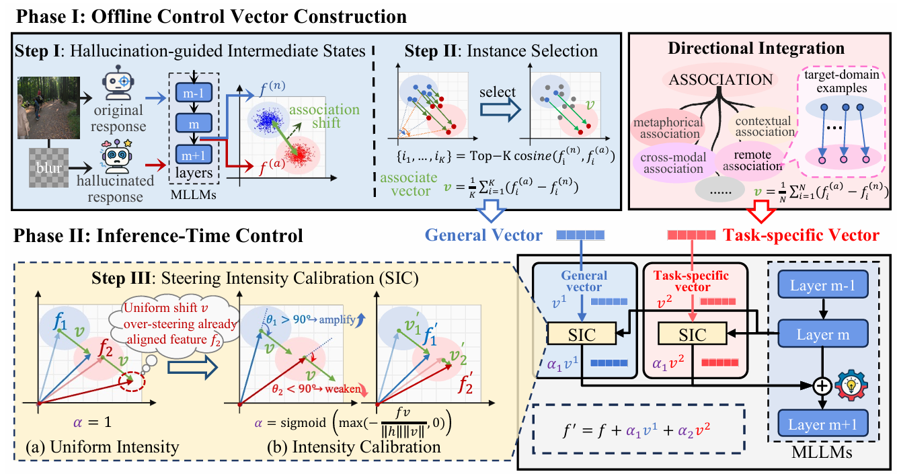
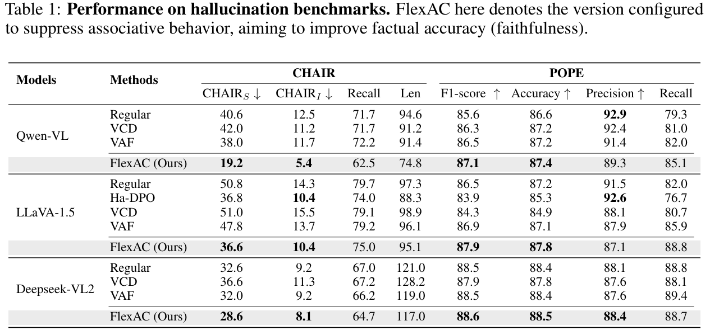
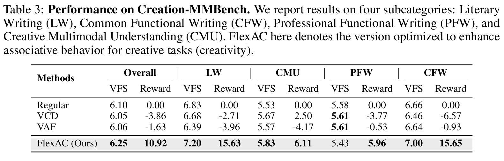

# Flexible-Association-Control

Official implementation for the NeurIPS 2025 paper: "FlexAC: Towards Flexible Control of Associative Reasoning in Multimodal Large Language Models". A lightweight, training-free framework for modulating associative behavior in MLLMs.

---

## Overall

Multimodal large language models often face a trade-off between **faithfulness** and **creativity**. FlexAC treats both as different manifestations of **associative reasoning strength**, and performs lightweight inference-time control on hidden representations to switch between lower-association factual behavior and higher-association creative behavior.


### Method Summary

FlexAC consists of two phases. In the **offline control vector construction** phase, we derive associative directions from hallucination-guided hidden-state differences, select high-association instances to build more stable steering vectors, and optionally incorporate a few task-specific samples. In the **inference-time control** phase, we inject the steering vector into middle layers of Qwen-VL and adaptively calibrate its strength, enabling the model to either suppress excessive association for factual tasks or enhance association for creative tasks.





---

## Requirements

### 1. Key Libraries

The main dependencies for the released Qwen version are:

- `torch==2.1.2`
- `transformers==4.37.2`
- `numpy==1.26.4`

Install with:

```bash
conda create -n flexac python=3.10 -y
conda activate flexac
pip install -r requirements.txt
pip install -e .
```

### 2. Datasets

This release mainly supports the Qwen experiments on:

- `ChairDataset` for hallucination evaluation
- `POPE` for object hallucination evaluation
- `VDAT_Dataset` for associative reasoning evaluation
- `Creation_MMBench` for creative generation evaluation


For `Creation_MMBench`, GPT-based judging is required. Please set:

```bash
export OPENAI_API_KEY=YOUR_API_KEY
export OPENAI_API_BASE=YOUR_API_BASE
```

### 3. Control Vectors

This release includes the **precomputed Qwen control vectors** used by FlexAC:

- `general_vector/feature/text_normal_fea.pt`
- `general_vector/feature/text_creative_fea.pt`

The released code expects the control vector directory to look like:

```text
general_vector/
└── feature/
    ├── text_normal_fea.pt
    ├── text_creative_fea.pt
    ├── qwen_chat_2questions.jsonl
    ├── key_ans.json
    ├── option_sorts.json
    └── image_names_record.json
```

If you want to use your own vectors, keep the same file names and place them in the same directory.

### 4. Directory Overview

If you only care about the **core FlexAC-Qwen implementation**, the main files are:

- `vlmeval/vlm/qwen_vl_flexac_top.py`
- `vlmeval/config.py`
- `baseline_qwen.sh`
  - baseline inference/evaluation script for Qwen-VL-Chat
- `flexac_qwen.sh`
  - FlexAC inference/evaluation script for Qwen-VL-Chat


---

## QuickStart

### 1. Prepare Required Vectors

For the released Qwen setting, we already provide the precomputed vectors in:

```bash
./general_vector/feature
```

### 2. Run FlexAC Intervention

Run the original Qwen baseline:

```bash
bash baseline_qwen.sh
```

Run FlexAC on Qwen:

```bash
bash flexac_qwen.sh
```

Useful control variables used by the released implementation:

- `FLEXAC_CONTROL_FACTOR`
  - `-1` for faithfulness-oriented control (FlexAC-P)
  - `1` for creativity-oriented control (FlexAC-C)


In the released Qwen setting, the default control layers are:

```bash
export CONTROL_LAYERS="15 16 17"
```

---

## Results

FlexAC is designed to support **both ends** of associative control:


### Table 1: Hallucination Benchmark





### Table 3: Creation-MMBench





## Additional Downloads

Due to GitHub repository size limits, the released **datasets** and **general vectors** are provided as **release assets** instead of being stored directly in this repository.

Please download the required files from the GitHub Release page and place them in the correct locations before running the code.

### Released Assets

The current release includes the following attachments:

- `general_vector.part1.rar`
- `general_vector.part2.rar`
- `general_vector.part3.rar`
- `VDAT_Dataset.rar`
- `Creation_MMBench.rar`

### Where to Place the Files

- The extracted `general_vector` folder should be placed under the **repository root**, i.e.:

```text
FlexAC/
└── general_vector/
```

- The extracted datasets should be placed under the `LMUData` directory.

```text
LMUData/
├── VDATDataset_v2.tsv
└── Creation_MMBench.xlsx
```


---

## Citing this work

If you find this project useful, please cite our paper:

```bibtex
@article{lyu2025flexac,
  title={FlexAC: Towards Flexible Control of Associative Reasoning in Multimodal Large Language Models},
  author={Lyu, Xinyu and Wang, Shuailong and Yuan, Shengming and Chen, Beitao and Song, Jingkuan and Gao, Lianli},
  journal={arXiv preprint arXiv:2510.11190},
  year={2025}
}
```

---
